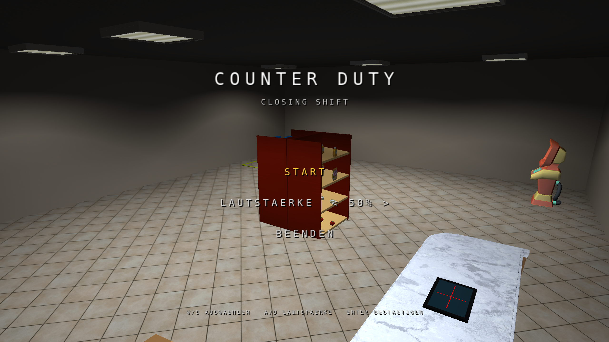

# Counter Duty: Closing Shift

Counter Duty is a first-person supermarket game developed in C++ and OpenGL. During a closing shift, the player accepts orders, selects the correct products, scans their barcodes, packs and seals a delivery box, and brings it to the dispatch area. Random cleaning events add a second task loop to the shift.

## Gameplay

- Accept customer orders at the terminal.
- Pick products from automatically refilling shelves.
- Align each barcode correctly at the checkout scanner.
- Pack the requested products into a physics-based delivery box.
- Close and seal the box before moving it to the delivery area.
- Respond to spills with the mop and cleaning station.

## Technical highlights

- C++17 desktop application with OpenGL rendering
- First-person camera, ray-cast interaction, highlighting, and collision handling
- Rigid-body product physics powered by ReactPhysics3D
- Carry system with free object rotation and collision-aware placement
- Scanner validation based on transformed barcode position and orientation
- Delivery-box state machine with lid animation, packing validation, and sealed contents
- Asset loading through Assimp and FreeImage
- Audio playback through miniaudio

## Controls

| Input | Action |
| --- | --- |
| `W` / `A` / `S` / `D` | Move |
| Mouse | Look around |
| `E` | Interact, pick up, or put down |
| Right mouse button | Rotate a carried object with the mouse |
| Left mouse button | Scan or perform the contextual primary action |
| `F` | Open or close the focused delivery box |
| `Esc` | Pause or go back |
| Arrow keys or `W` / `S` | Navigate menus |
| Arrow keys or `A` / `D` | Change menu volume |
| `Enter` or `E` | Confirm a menu selection |
| `F3` | Toggle debug visualization |

## Build and run

### Requirements

- Windows 10 or newer
- Visual Studio with the **Desktop development with C++** workload
- Git support for the vcpkg manifest dependency restore

### Steps

1. Open `CGVStudio/CGVStudio.sln` in Visual Studio.
2. Select `Release` and `Win32`.
3. Build the solution. Visual Studio restores the dependencies declared in `CGVStudio/CGVStudio/vcpkg.json` automatically.
4. Start the project from Visual Studio so that the project working directory is used and the `assets` folder can be resolved.

### Optional local asset overrides

Some assets used in the original university version could not be redistributed as raw files because of their copyright and license terms. For the public source-code version, the original terminal, shelf, ceiling-light, music, intro, scanner, and barcode assets were therefore replaced with original, redistributable alternatives.

The game still supports local-only copies of the original assets under `assets/local`. This directory is intentionally ignored by Git and is not part of the public repository. When those local files are unavailable, the game automatically uses the included replacements, so a fresh clone remains buildable and playable.

## Project context

The game was created by Thomas Koch and Marie Müller as a two-person university computer-graphics project. Both authors worked on the gameplay systems, rendering integration, interaction logic, physics, and overall game implementation.

Parts of `src/engine` are based on framework classes supplied for the computer-graphics course and are published here with permission from the course instructor. AI tools were used during development as a pair-programming aid; suggestions were reviewed, adapted, and integrated by the project authors.

Third-party libraries and assets, including required attribution, are documented in [THIRD_PARTY_NOTICES.md](THIRD_PARTY_NOTICES.md).

## Source-code rights

Unless a third-party notice states otherwise, no license is granted for the original project code or original project assets. All rights are reserved by their respective authors.
